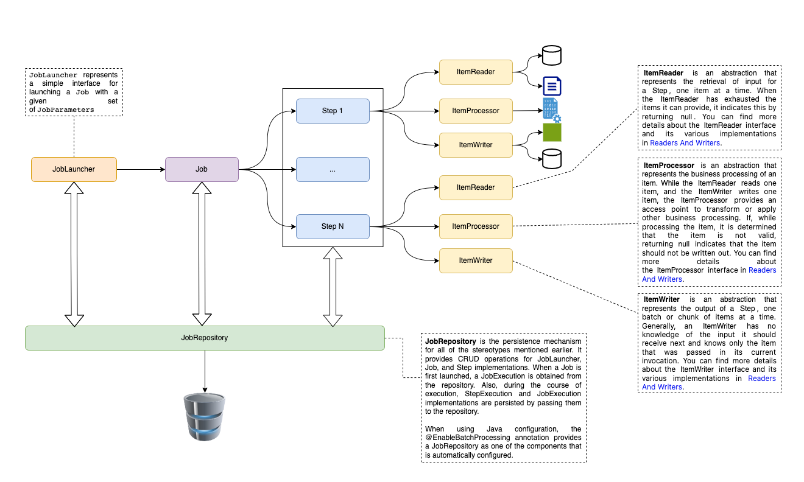
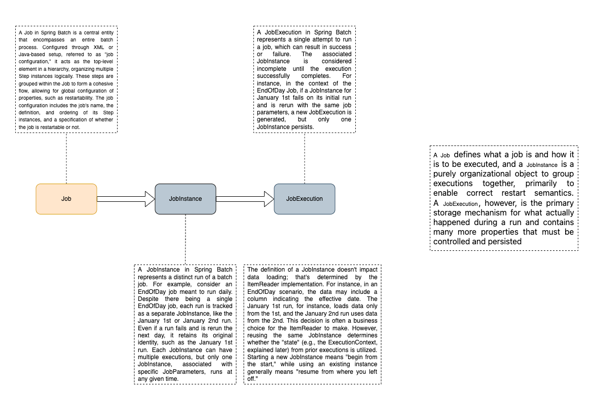
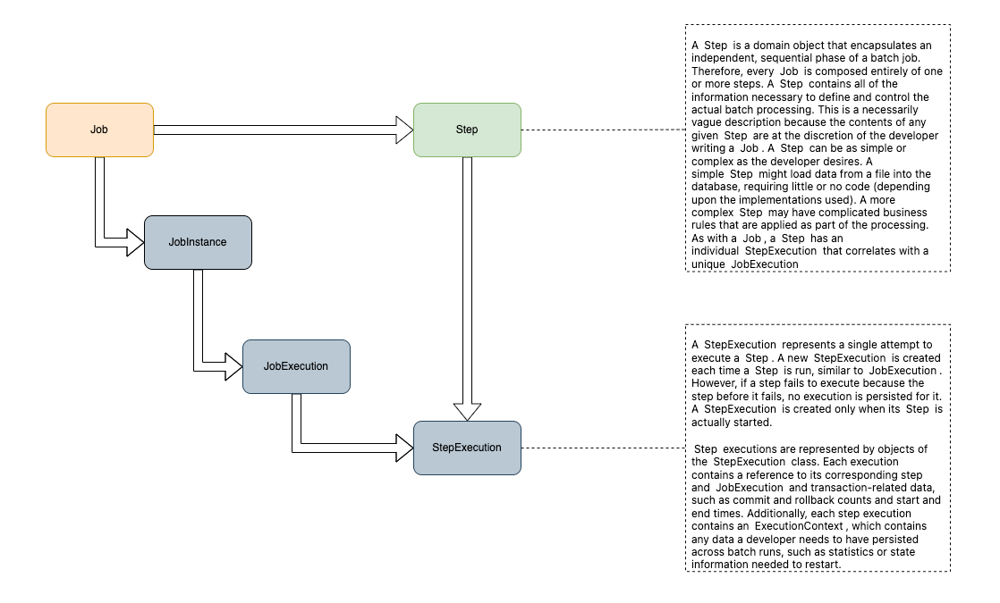

# Spring Batch Demo

This repository serves as a demonstration illustrating the process of file import through batch processing. You can find a comprehensive video tutorial on this topic available on YouTube via the following link. The tutorial has been created by Ali Bouali, also known as Alibou.

---


## Table of Contents

- [Introduction](#introduction)
- [Job](#job)
- [Step](#step)
- [JobInstance](#jobinstance)
- [JobExecution](#jobexecution)
- [Getting Started](#getting-started)

## Introduction

Spring Batch is a framework for building robust and scalable batch processing applications in Java. It simplifies the development of batch jobs by providing reusable building blocks.



---
## Job

A **Job** in Spring Batch is the top-level entity that encapsulates an entire batch process. It is configured using either XML or Java-based configuration. A Job is a container for **Step** instances, grouping logically related steps together. It allows for global configuration, such as restartability.



---

### Configuration Example:

```java
@Configuration
@RequiredArgsConstructor
public class BatchConfig {

    private final JobRepository jobRepository;
    private final PlatformTransactionManager platformTransactionManager;
    private final StudentRepository repository;

    @Bean
    public FlatFileItemReader<Student> reader() {
        FlatFileItemReader<Student> itemReader = new FlatFileItemReader<>();
        //...
        return itemReader;
    }

    @Bean
    public StudentProcessor processor() {
        return new StudentProcessor();
    }


    @Bean
    public RepositoryItemWriter<Student> writer() {
        RepositoryItemWriter<Student> writer = new RepositoryItemWriter<>();
        writer.setRepository(repository);
        writer.setMethodName("save");
        return writer;
    }

    @Bean
    public Step step1() {
        return new StepBuilder("csvImport", jobRepository)
                .<Student, Student>chunk(1000, platformTransactionManager)
                .reader(reader())
                .processor(processor())
                .writer(writer())
                .taskExecutor(taskExecutor())
                .build();
    }

    @Bean
    public Job runJob() {
        return new JobBuilder("importStudents", jobRepository)
                .start(step1())
                .build();

    }

    @Bean
    public TaskExecutor taskExecutor() {
        SimpleAsyncTaskExecutor asyncTaskExecutor = new SimpleAsyncTaskExecutor();
        asyncTaskExecutor.setConcurrencyLimit(10);
        return asyncTaskExecutor;
    }

    private LineMapper<Student> lineMapper() {
        DefaultLineMapper<Student> lineMapper = new DefaultLineMapper<>();

        DelimitedLineTokenizer lineTokenizer = new DelimitedLineTokenizer();
        lineTokenizer.setDelimiter(",");
        lineTokenizer.setStrict(false);
        lineTokenizer.setNames("id", "firstName", "lastName", "age");

        BeanWrapperFieldSetMapper<Student> fieldSetMapper = new BeanWrapperFieldSetMapper<>();
        fieldSetMapper.setTargetType(Student.class);

        lineMapper.setLineTokenizer(lineTokenizer);
        lineMapper.setFieldSetMapper(fieldSetMapper);
        return lineMapper;
    }
}
```

## Step
A Step is a fundamental building block within a Job. It represents a single phase of the batch processing and consists of an ItemReader, ItemProcessor, and ItemWriter. Steps are organized within a Job to create a flow, and each step can be configured individually.



---

## JobInstance

A **JobInstance** represents a logical run of a batch job. For example, if you have a daily job, each run on a specific day is a separate JobInstance. It helps track and manage individual job runs. Each JobInstance can have multiple JobExecutions, but only one JobInstance can run at a given time.

### Example Scenario:
- January 1st run
- January 2nd run

## JobExecution
A JobExecution represents a single attempt to run a Job. It can end in success or failure. A JobInstance is considered incomplete until the JobExecution successfully completes. Even if a JobInstance is rerun, a new JobExecution is created. A JobExecution is the primary storage for the details of what happened during a run.

### Example Scenario:
- January 1st run (initial run)
- January 1st run (rerun)


## Getting Started
To get started with Spring Batch, you can follow these steps:

### Set up your Spring Batch project.
- Define your Job and configure its steps.
- Implement ItemReader, ItemProcessor, and ItemWriter for your specific use case.
- Configure your database and set up any necessary infrastructure.
- Run your Spring Batch job and monitor the JobExecution details.

### More details

For more details, please refer to the Spring batch official documentation [Visit the official Spring Batch Documentation](https://docs.spring.io/spring-batch/docs/current/reference/html/index.html)
